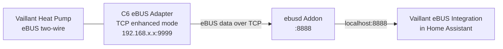

<p align="center">
  
</p>

> **Disclaimer:** This project is an independent third-party integration and is **not affiliated with, endorsed by, or connected to Vaillant GmbH** in any way. All trademarks belong to their respective owners.

# Vaillant eBUS

Home Assistant integration for Vaillant heat pumps via **direct ebusd TCP** — no MQTT, no cloud.

Reads & writes 350+ eBUS registers from your heat pump, heating controller, and DHW system. Fully local, no internet required.

A **1-on-1 replacement for the mypyllant API integration** — climate entities (quick veto, away mode via calendar), water_heater entities (DHW boost, temp control), room humidity, and all sensors, fully local without cloud dependency.

## Architecture



The C6 adapter converts the eBUS two-wire signal to TCP. ebusd runs as a Home Assistant addon and decodes the eBUS data. The integration connects to ebusd (inside Home Assistant, port 8888) — it never connects to the C6 adapter directly.

**Important:** When adding the integration, point it to **Home Assistant's own address** (or `localhost`), not the C6 adapter's IP. Port is always `8888` (ebusd's TCP API), never `9999` (C6 adapter port).

## Features

- Drop-in replacement for mypyllant API integration — same entities, no cloud
- Direct TCP connection to ebusd — zero MQTT setup required
- Auto-discovers all registers on connect
- 60+ entity types generated: sensor, binary_sensor, number, select, switch, climate, water_heater, calendar
- Climate entities with quick veto and away mode (calendar-based scheduling)
- Water heater entities with DHW boost and temperature control
- Room humidity (CTLV2) — not available via standard ebusd MQTT
- Read & write any register via HA services (`vaillant_ebus.read_parameter`, `vaillant_ebus.write_parameter`)
- Custom registers via `--enabledefine` (e.g. room humidity)
- YAML overrides for entity metadata (names, icons, units)

## Prerequisites

- Home Assistant 2025.1+
- C6 eBUS adapter connected to your Vaillant heat pump
- ebusd running as HA addon

Known compatible heat pumps: aroTHERM, aroTHERM plus, VWL series. Other Vaillant models with eBUS should work too — the integration auto-discovers whatever registers the heat pump exposes.

## Step 1: Configure the C6 eBUS adapter

The C6 adapter bridges your heat pump's eBUS to your LAN.

1. Connect the C6 adapter to a PC using **USB-C**.
2. Configure the adapter:
   - Set it to **WiFi mode** and connect it to your home network.
   - Assign a **fixed IP address** in your router (DHCP reservation).
3. Disconnect from PC and connect the C6 adapter to the **Vaillant heat pump**.
4. Switch the adapter to **TCP enhanced mode**.

The adapter is ready when it has a fixed IP on your LAN (e.g. `192.168.86.24`).

## Step 2: Install ebusd

1. Go to **Settings → Add-ons → Add-on store**
2. Click the **three-dot menu → Repositories**, add: `https://github.com/LukasGrebe/ha-addons/` (HA wrapper for [john30/ebusd](https://github.com/john30/ebusd))
3. **Install ebusd** from the addon store
4. Go to **Configuration** and set:

```yaml
network_device: ens:192.168.86.24
seed_mqtt_cfg: false
commandline_options:
  - "--accesslevel=*"
  - "--port=8888"
  - "--enabledefine"
```

Replace `192.168.86.24` with your C6 adapter's fixed IP.

| Setting | Purpose |
|---------|---------|
| `network_device` | C6 adapter in TCP enhanced mode: `ens:<ip>:<port>` |
| `seed_mqtt_cfg: false` | Disable MQTT — not needed |
| `--accesslevel=*` | Full read/write access to all registers |
| `--port=8888` | Raw TCP command port — this integration connects to this |
| `--enabledefine` | Allows runtime register creation (needed for room humidity) |

Do **not** add `--mqttjson`, `--mqttint`, or `--configpath`.

5. **Start** the addon and wait until it shows **"running"** in the addon dashboard
6. **Verify** — open the addon log. You should see:

```
ebusd 26.1.26.1 started with broadcast scan on device:
192.168.86.24, TCP, enhanced

bus started with own address 31/36
signal acquired
```

This confirms ebusd is talking to the C6 adapter and has acquired the eBUS signal.

If you see `ERR: element not found` for some registers, that is normal — your hardware just doesn't support them. If you see **no signal acquired**, check:
- The C6 adapter is powered and connected to the heat pump.
- The C6 adapter is in TCP enhanced mode.
- The IP and port in `network_device` are correct.

## Step 3: Install this integration

### HACS (recommended)

1. Go to **HACS → Integrations → three-dot menu → Custom repositories**
2. Repository URL: `https://github.com/MarkBovee/vaillant-ebus`
3. Category: **Integration**
4. Click **Add**, then install **"Vaillant eBUS"** from HACS
5. **Restart HA**

### Manual

1. Copy `custom_components/vaillant_ebus/` to your HA `config/custom_components/vaillant_ebus/`
2. Restart HA

## Step 4: Add the integration

1. Go to **Settings → Devices & Services → Add Integration**
2. Search for **"Vaillant eBUS"**
3. The integration tries to discover ebusd automatically on `localhost` and `homeassistant.local`. If it succeeds, no further input is needed.
4. If auto-discovery fails, enter the ebusd host and port manually:
   - **Host**: Home Assistant's own IP address (or `localhost`)
   - **Port**: `8888` (ebusd TCP API, not the C6 adapter port)
   - Do **not** enter the C6 adapter's IP. The integration talks to ebusd inside HA, not to the adapter.
5. Devices appear within 30 seconds.

### Expected devices

| Device | Circuit | Description |
|--------|---------|-------------|
| Vaillant aroTHERM heat pump | `hmu` | Heat pump telemetry |
| Vaillant CTLV2 heating control | `ctlv2` | Heating controller (zone, DHW) |
| Vaillant VWZ00 ventilation | `vwz00` | Ventilation unit |
| Vaillant system | `Broadcast` | eBUS broadcast values |

### YAML entity overrides

Create `config/vaillant_ebus/entities.yaml` to override auto-detected metadata:

```yaml
ctlv2.HwcTempDesired:
  friendly_name: "DHW Target Temperature"
  icon: "mdi:water-thermometer"
  unit: "°C"
  device_class: "temperature"
```

Available override keys: `friendly_name`, `icon`, `unit`, `device_class`, `entity_category`, `entity_type`, `enabled`, `writable`, `min`, `max`, `step`, `options`.

## Services

| Service | Description |
|---------|-------------|
| `vaillant_ebus.read_parameter` | Read a register by circuit and name |
| `vaillant_ebus.write_parameter` | Write a value with read-after-write verification |
| `vaillant_ebus.refresh` | Force re-read all active registers |
| `vaillant_ebus.rediscover` | Re-run entity discovery (finds new registers) |

## Updating

HACS notifies you when a new release is available. To update:

1. Go to **HACS → Integrations → Vaillant eBUS**
2. Click **"Update"** (if available)
3. **Restart HA**

## Troubleshooting

See [docs/troubleshooting.md](docs/troubleshooting.md).

## Community & support

[GitHub Discussions](https://github.com/MarkBovee/vaillant-ebus/discussions) is the place for questions, discoveries, and feedback.

| Category | When to use |
|----------|-------------|
| Q&A | Setup help, "will this work with my model" questions |
| Data Reports | Share register dumps, telemetry exports, and data findings from any Vaillant model |
| Comparisons & Feedback | Compare with myVaillant, mypyllant, ebusd MQTT; workflow feedback |
| Ideas | Feature requests that aren't formal issues yet |
| Announcements | Release notes and breaking changes (maintainer only) |

**Bugs & crashes** → [GitHub Issues](https://github.com/MarkBovee/vaillant-ebus/issues)

## License

Apache 2.0
